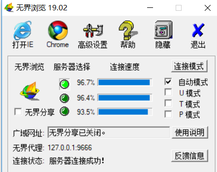

## 翻墙小工具III

### 如何使用

双击u.exe，出现如图(正常效果):

还有对应的IE浏览器会弹出这个图，这样就能表示真正的翻墙了，接下来就可以使用Google搜索了，如图(千万不要关):

接下来打开Chrome直接输入:https://google.com
然后搜索对应的关键字，就可以看到Google检索到的界面了，如图(示例):

不过有个缺点:
就是太慢了，而且有的时候还不灵需要多次关闭。

当然了，如果你觉得这个免费的翻墙工具不行的话，可以使用Bing或者付费的VPN。
或者是你有更好的，可以提issue，分享一下。

